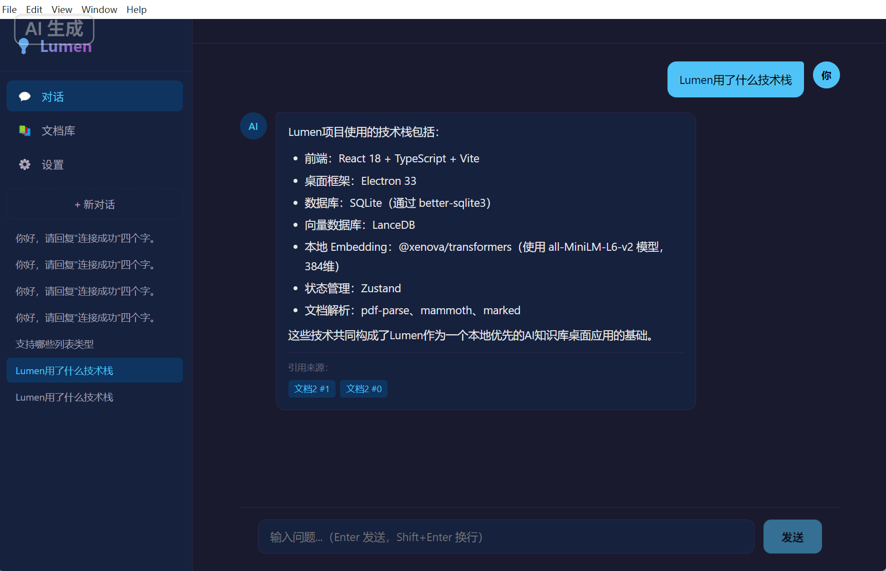
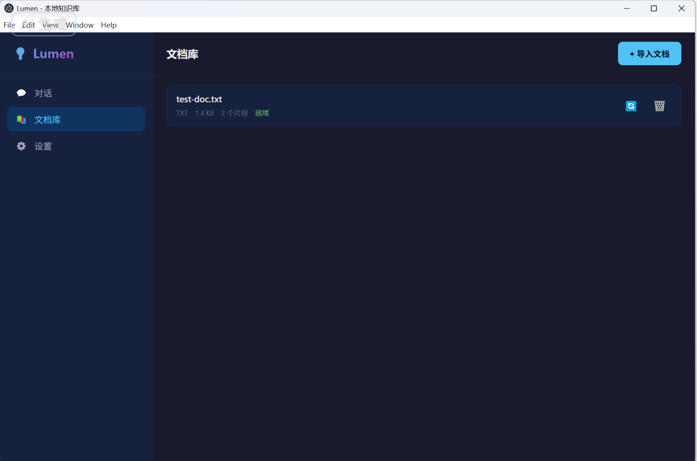

# 💡 Lumen

> 本地优先的 AI 知识库桌面应用 —— 把文档变成可对话的知识库，数据不出本地。

Lumen 是一个基于 RAG（检索增强生成）技术的桌面知识库工具。导入文档后，AI 会基于你的文档内容回答问题，并标注引用来源。Embedding 模型在本地运行，只有检索到的上下文会发送给你配置的 LLM API。

## ✨ 功能特性

- **多格式文档导入** — 支持 TXT、Markdown、PDF、Word（.docx）
- **本地 Embedding** — 使用 [all-MiniLM-L6-v2](https://huggingface.co/Xenova/all-MiniLM-L6-v2) 模型，数据不出境
- **混合检索** — 向量相似度检索 + 中文关键词加权（bigram 分词），提高召回准确率
- **来源引用** — AI 回答标注引用的文档片段，可溯源
- **多轮对话** — 自动维护对话历史，支持创建多个对话
- **OpenAI 兼容** — 支持智谱 GLM、DeepSeek、硅基流动、OpenAI 等任意 OpenAI 格式的 API
- **Markdown 渲染** — AI 回复支持标题、列表、代码块、表格等格式
- **本地存储** — SQLite 存储结构化数据，LanceDB 存储向量，无需外部数据库
- **隐私优先** — 文档解析、分块、向量化全部在本地完成

## 📸 截图预览

**智能对话** — 基于文档内容回答问题，标注引用来源


**文档库** — 管理已导入的知识库文档


**设置** — 一键配置 LLM，内置多家预设，支持连接测试


## 🛠 技术栈

| 层级 | 技术 |
|------|------|
| 桌面框架 | Electron 33 |
| 前端 | React 18 + TypeScript + Zustand |
| 构建工具 | Vite 6 + vite-plugin-electron |
| 结构化存储 | SQLite（better-sqlite3） |
| 向量数据库 | LanceDB（嵌入式） |
| 本地 Embedding | @xenova/transformers（ONNX Runtime） |
| 文档解析 | pdf-parse / mammoth / 原生文本 |
| Markdown | marked |

## 🏗 架构

```
┌─────────────────────────────────────────────┐
│                  Electron                    │
│                                              │
│  ┌──────────┐    IPC     ┌────────────────┐  │
│  │ React UI │ ◄────────► │  Main Process  │  │
│  │ (渲染进程) │  contextBridge  │              │  │
│  └──────────┘            │ ┌────────────┐ │  │
│                          │ │  Parsers   │ │  │
│                          │ │ TXT/PDF/   │ │  │
│                          │ │ DOCX/MD    │ │  │
│                          │ └─────┬──────┘ │  │
│                          │       ▼        │  │
│                          │ ┌────────────┐ │  │
│                          │ │  Chunker   │ │  │
│                          │ │ 递归字符分割 │ │  │
│                          │ │ + overlap  │ │  │
│                          │ └─────┬──────┘ │  │
│                          │       ▼        │  │
│                          │ ┌────────────┐ │  │
│                          │ │  Embedder  │ │  │
│                          │ │ MiniLM-L6  │ │  │
│                          │ │ (本地运行)  │ │  │
│                          │ └─────┬──────┘ │  │
│                          │       ▼        │  │
│              ┌───────────┴───────────┐    │  │
│              ▼                       ▼    │  │
│     ┌─────────────┐         ┌──────────┐  │  │
│     │   SQLite    │         │ LanceDB  │  │  │
│     │ 文档/对话/   │         │ 向量存储  │  │  │
│     │ 消息/配置    │         │ 相似度检索 │  │  │
│     └─────────────┘         └─────┬────┘  │  │
│                                   │       │  │
│                          ┌────────▼──────┐│  │
│                          │   LLM API    ││  │
│                          │ (OpenAI兼容)  ││  │
│                          └──────────────┘│  │
└─────────────────────────────────────────────┘
```

### RAG 流程

1. **文档导入**：解析文件 → 递归字符分块（500 字符 + 80 overlap）→ 本地 Embedding → 存入 LanceDB
2. **问答检索**：用户问题 → Embedding → 向量相似度检索（topK×2）→ 中文关键词加权重排 → 取 topK=6
3. **生成回答**：检索片段 + 历史消息 → 构建 Prompt → 调用 LLM API → 返回回答 + 来源引用

## 🚀 快速开始

### 环境要求

- Node.js >= 18
- npm

### 安装与运行

```bash
# 克隆仓库
git clone https://github.com/lujiahuac/luman.git
cd luman

# 安装依赖
npm install --legacy-peer-deps

# 启动开发模式
npm run dev
```

### 配置 LLM

首次启动后，进入「设置」页面，配置 OpenAI 兼容的 API：

| 服务 | Base URL | 模型 |
|------|----------|------|
| 智谱 AI（免费） | `https://open.bigmodel.cn/api/paas/v4` | `glm-4-flash` |
| DeepSeek | `https://api.deepseek.com/v1` | `deepseek-chat` |
| 硅基流动 | `https://api.siliconflow.cn/v1` | `Qwen/Qwen2.5-7B-Instruct` |
| OpenAI | `https://api.openai.com/v1` | `gpt-4o-mini` |

配置后可点击「测试连接」验证，然后在文档库导入文档即可开始对话。

## 📁 项目结构

```
luman/
├── electron/                  # Electron 主进程
│   ├── main.ts               # 应用入口
│   ├── preload.ts            # 上下文桥接
│   ├── config.ts             # LLM 配置管理
│   ├── db/
│   │   ├── index.ts          # SQLite 连接
│   │   └── schema.sql        # 数据库表结构
│   ├── parsers/              # 文档解析器
│   │   ├── index.ts          # 统一入口
│   │   ├── text.ts           # TXT / Markdown
│   │   ├── pdf.ts            # PDF
│   │   └── docx.ts           # Word
│   ├── rag/                  # RAG 核心
│   │   ├── chunker.ts        # 文档分块
│   │   ├── embedder.ts       # 本地 Embedding
│   │   ├── vectorStore.ts    # LanceDB 向量存储
│   │   ├── retriever.ts      # 混合检索
│   │   └── prompt.ts         # Prompt 构建
│   └── ipc/                  # IPC 处理器
│       ├── chat.ts           # 对话
│       ├── documents.ts      # 文档管理
│       ├── search.ts         # 搜索
│       ├── config.ts         # 设置
│       └── dialog.ts         # 文件对话框
├── src/                      # React 渲染进程
│   ├── App.tsx
│   ├── components/
│   │   ├── ChatView.tsx      # 对话界面
│   │   ├── DocumentLibrary.tsx
│   │   ├── Settings.tsx
│   │   └── Sidebar.tsx
│   ├── stores/app.ts         # Zustand 状态管理
│   └── types/index.ts        # TypeScript 类型
└── vite.config.ts
```

## 📝 License

MIT
